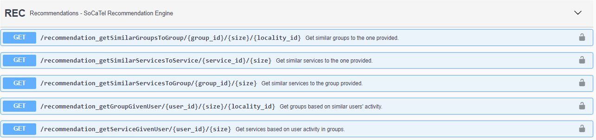
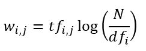
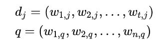
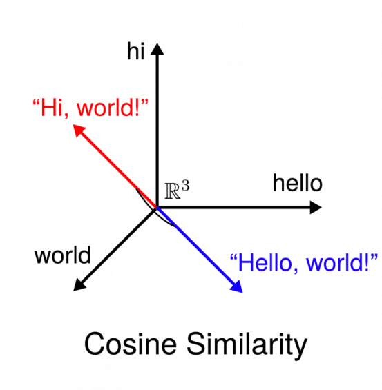
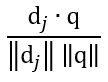
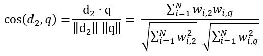
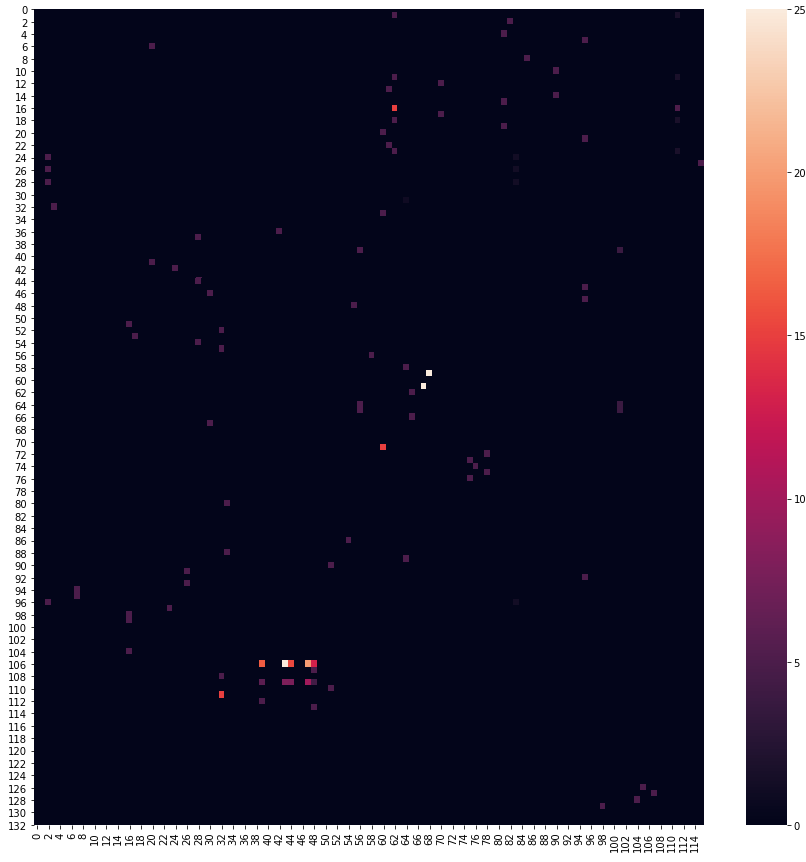
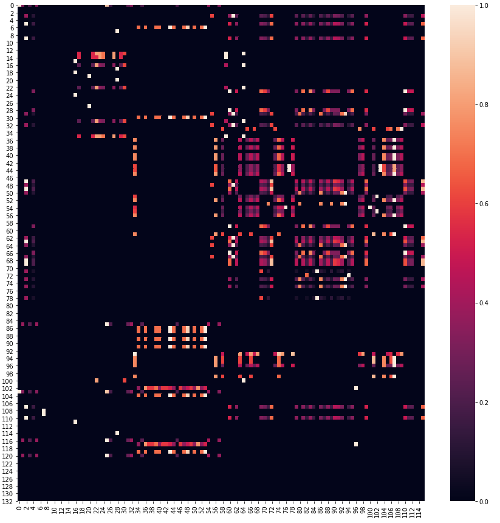

# Recommendation engine data processing module

In the manual, we will review the inputs and outputs for each of the recommendation approaches, collaborative and 
content-based, as well the mechanisms that we use in this module to provide these. The 
"/recommendation_getGroupGivenUser" endpoint falls under the collaborative and the rest under the content based approach.



Before we get started, let's visit how Elasticsearch establishes similarity between documents. Elasticsearch runs Lucene
 under the hood so by default it uses Lucene's Practical Scoring Function. This is a similarity model based on Term 
 Frequency (tf) and Inverse Document Frequency (idf) that also uses the Vector Space Model (vsm) for multi-term queries.
 1. Tf-idf:
    TF-IDF is one of the most popular and state-of-the art Natural Language Processing (NLP) algorithms. TF-IDF is 
    categorised as one of the Content-Based Filtering (CBF) techniques. It stands for Term Frequency – Inverse Document 
    Frequency (thus TFIDF) and it is used to reflect the importance of a keyword to a document in a collection
    of corpuses.
    
    TF is calculated by the frequency of a word in each document in the corpus. In other words, it is the ratio of word 
    occurrences compared to the total number of words in the document. The equation of TF can be defined as:
    
    
    
    - tf_i,j represents the number of occurrences of i in j, hence the name document frequency. The terms i and j here 
        correspond to words in Elasticsearch
    - df_i represents the number of documents containing i, hence the inverse document frequency used to help the 
        algorithm emphasize on unique words.  
    - N is equal to the total number of documents 
    
 2. Vsm:
    This model represents documents and queries as vectors of identifiers. Each dimension of the vector corresponds to 
    separate terms, which are represented by keywords in the Elasticsearch context. These act as weights, and the tf-idf
    scheme described above is one method of deriving these. Given these vectors, seen below, it is possible to produce 
    relevance rankings between them. 
    
    
    
    The term d_j represents an arbitrary document and q an arbitrary query here. Within this module, the cosine of the 
    angle between vectors is used. The following figure shows a simplistic representation with only three terms and the
    cosine similarity between two sentences. In general, the smaller the angle, the more similar the words:
    
    
    
    Cosine similarity is generally expressed by:
    
    
    
    The dot product represents the interaction between all values in the vector space models. Replacing these for a 
    hypothetical document 2 and query q we get:
    
    
3. Okapi BM25:
   Elasticsearch goes beyond tf-idf to eliminate common issues when forming similarity scores. Consider the case where 
   the term "co-creation" is mentioned 200 times in one document and 100 in another. In linear terms, this would mean 
   that the first document is twice as relevant compared to the second. This is most probably not the case 
   
   After a certain point of repetition, the likelihood of relevance does not necessarily increase. Put differently, once
    a document is saturated with occurrences of a term, more occurrences should not a have a significant impact on the 
    score. Optimally, contribution of the term frequency term would increase fast when it is small and then increase 
    more slowly, approaching a limit, as it gets very big. This is called term saturation and it is introduced in the 
    BM25 algorithm.
    
   The second element considered here is document length. If a document happens to be really short and it contains 
   "co-creation” once, that’s a good indicator that "co-creation” is important contextually. For longer documents, 
   however, where "co-creation" is mentioned only once would mean that the document is probably not about "co-creation".
   So matches in larger documents should be penalised based on their length, given the average length of documents in 
   our corpus.
   
   For more information behind the mathematical approach in achieving these, please visit the link 
   [here](https://nlp.stanford.edu/IR-book/html/htmledition/okapi-bm25-a-non-binary-model-1.html). 
    
Semantic relationships between socatel entities external data sources also play a vital role here. Firstly, the SoCaTel 
ontology model, contains many concepts and relations between parts of our Knowledge Base, providing a rich framework for
query languages to retrieve similar items given high level, humanly understandable filters. This can be seen
[here](https://github.com/SoCaTel/SoCaTel-ontologies/blob/main/resources/SoCaTelOntology.png),  

In order to map this ontology to external data sources, such as social media posts, we have devised a mapping mechanism
to incorporate them in the KB, an example of which for Twitter data is seen 
[here](https://github.com/SoCaTel/SoCaTel-ontologies/blob/main/resources/TwitterHandler.png). Consequently, we can use
the same framework to retrieve related items based on the context.

In the recommendation engine, we make extensive use of the socatel:topic -> skos:Concept[] relationship. Using this 
mapping, we can establish relationships between external content (such as twitter posts) to one or more of the 
pre-defined topics in the platform.

With the above in mind, let's visit the two approaches.

## Collaborative-based recommendations

Collaborative recommendations are served based on predictions are about a user’s preferences when collecting 
information about other users’ preferences. Within SoCaTel, these preferences refer to SoCaTel co-creation groups which 
a user might be interested to join and participate. A measurable metric for quantifying this preference towards an 
item/entity comes with previous interactions in co-creation groups. The scoring system that we use, with an upper limit 
of 100 points and a lower of 0 is as follows:

```
history_action_rating_dict = {
    "history.created_group": 100,
    "history.posted_group": 10,
    "history.subscribed_group": 15,
    "history.unsubscribed_group": -20,
    "history.viewed_group": 5,
    "history.joined_group": 25
}
```

Inactivity is also rewarded negatively at a daily basis, with a score of -1 to avoid having groups with which users did 
not recently interacted with being consistently recommended, found [here](https://github.com/SoCaTel/data-preprocessing-engine/blob/f52a15faae4d41755d7abc61d57d706f907902b9/recommendation_engine/src/scorers/uim_scorer.py#L178).
This was not enough however, especially for users that have barely participated in any groups. This is evident from the 
figure below, showing accumulated user activity during early stages of the platform during co-creation in the pilot sites.
The x-axis are user ids and the y-axis are co-creation group ids: 



In this regard, we employ content-based recommendations in tandem with our user activity scoring system. Artificial 
scores, weighted by the Okapi BM25 similarity measures, are created for groups similar to those that users have already 
participated in. This is implemented in 
[this](https://github.com/SoCaTel/data-preprocessing-engine/blob/f52a15faae4d41755d7abc61d57d706f907902b9/recommendation_engine/src/scorers/uim_scorer.py#L237)
function call. Consequently, we are able to construct rich information matrices, at a daily basis, and achieve more 
realistic results when this is fed into matrix completion algorithms.

 

Matrix completion is key here in generating predictions of future user activity in groups with which they have not
interacted with yet. This is done using the PredictionIO framework. At its core, the framework can use two techniques, 
depending on the data provided. In our settings, since our data are converted into a singular score for each item per 
user, we use the explicit feedback case. 

At its core, this case utilises the Singular Value Decomposition (SVD) algorithm. This works by taking an orthogonal 
matrix A, such as the one we have prepared above, and decompose it into the product of three distinct matrices: 
    

- U contains hidden features describing the columns of the original matrix
- V contains hidden features describing the rows of the original matrix
- Σ represents the square roots of linearly transformed vectors within matrix A. These are hierarchically ordered.

By omitting the least important values in Σ, we can approximate the completed matrix A (dimensionality reduction), 
predicting user scores for all SoCaTel groups.

Generally, PredictionIO, through Spark, provides scalability, to support increasing numbers of users and groups being 
inserted in matrix A. Its API provides recommendations through the cosine-similarity algorithm once the full matrix is
completed.

## Content-based recommendations.

The core function used to recommend a list of groups given another can be found 
[here](https://github.com/SoCaTel/data-preprocessing-engine/blob/f52a15faae4d41755d7abc61d57d706f907902b9/recommendation_engine/src/scorers/iim_scorer.py#L176)
This function uses words to form vector space models from the following properties of a SoCaTel group:
1. Language
2. Themes
3. Title and item descriptions (using fuzzy matching)
4. Item locality (where the group in the world is taking place)

Furthermore, we utilise the semantic linkage of "socatel:topic -> skos:Concept[]" to retrieve a set of twitter posts that
related to the given group's themes. The function [here](https://github.com/SoCaTel/data-preprocessing-engine/blob/f52a15faae4d41755d7abc61d57d706f907902b9/recommendation_engine/src/scorers/utils.py#L287)
is responsible for this. After retrieving these, a set of important keywords is retrieve using the tf-idf algorithm, 
invoked [here](https://github.com/SoCaTel/data-preprocessing-engine/blob/f52a15faae4d41755d7abc61d57d706f907902b9/recommendation_engine/src/scorers/utils.py#L330).
All keywords in social media and SoCaTel group posts are cleaned using [this](https://github.com/SoCaTel/data-preprocessing-engine/blob/f52a15faae4d41755d7abc61d57d706f907902b9/recommendation_engine/src/scorers/utils.py#L61)
function. 

Using this expanded set of keywords and the ability of elasticsearch to fuzzily match these against the KB content, 
as seen in the query [here](https://github.com/SoCaTel/data-preprocessing-engine/blob/f52a15faae4d41755d7abc61d57d706f907902b9/recommendation_engine/src/scorers/iim_scorer.py#L130),
we are able to use the Okapi BM25 algorithm to produce similarity scores between groups and serve them as recommendations
to users.
