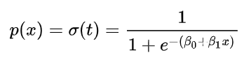
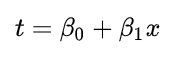

# Sentiment classification support module
This guide lists the step-by-step procedure to install, train and deploy the sentiment classification app in a single machine.

## Getting Started
### Prerequisites

All tools and processes are meant to be deployed under a docker container. To get everything set up, you should:

* Have docker installed in your machine. See [this](https://runnable.com/docker/install-docker-on-linux) for a general 
guide on Linux machines (preferred OS for this project).
* Have already deployed a MongoDB docker instance within a docker network. See instructions in the next section on how 
to set this up.
* Elasticsearch, for direct queries to the database. For help in setting this up and the necessary Elasticsearch indices
, refer to [this](https://github.com/SoCaTel/elasticsearch-schema) repository.
* After deploying a docker container, take a note of the docker instance's id, referenced as `<mongo_image_id>` here.
* Have a (virtual) python3 environment up and running with the requirements listed in the root directory of this project
 installed

**NOTE** This repository has been developed using Python 3.6

### Database setup
The project relies on a MongoDB for reliable storage of recommendations. If you have *not* already set up one for the
recommendation engine, following the steps below to do so:

* Pull a fresh container from [here](https://hub.docker.com/_/mongo).
* Switch into the project's directory `cd ~/engine_data_preprocessing`.
* Edit the `stack.yml` file with the port `<mongo_port>`, the username `<mongo_username>` and password 
`<mongo_password>` of your choice.
* Run `docker-compose -f stack.yml up --detach` to initialise a container hosting an instance of MongoDB.

### Training dataset setup

In order to prepare the training dataset used for SoCaTel, run the  
`./prepare_sentiment_training_dataset.py` script (in the directory of this README file), in case it is not available 
under the name `clean_default_sentiment_analysis.json`. Make sure that you have a (virtual) python environment with the 
necessary requirements installed, as stated at the beginning of this document. The dataset chosen represents comments 
about products/brands classified by positive/negative scores. It also combines this with the default sentiment analysis 
file given in the PIO engine (located in the current directory). 

As a final step, you will need to copy this dataset within the PredictionIO template. We will mention this later in this
documentation.

### Training algorithm used

Since we have reduced the problem to a binary classification one, algorithms such as logistic regression can produce
satisfactory results, when considering combination of words during the inference process. The "indicator" variable in 
our case is the sentiment score of 0 or 1. We assume that it is dependent on linear combinations of predictors (the 
words in a sentence) given by:



where the following term `t` expresses a combination of explanatory variables (in our case words in a sentence):



In the logistic model, `p(x)` is interpreted as the probability of the dependent variable equaling a positive rather
than negative sentiment.  Also note that we use a combination of <b>two consecutive words</b> to form a set of 
explanatory variables (ngram of 2). A regularization `\lambda` of value .5 is added to control the weights of the
parameters during the fitting process. We concluded with these hyper-parameters as a result of the `pio eval` step in
the PredictionIO documentation [here](http://predictionio.apache.org/demo/textclassification/).
 
This basic model should be able to achieve the following score, before reaching maximum iterations:

`[INFO] [LBFGS] Val and Grad Norm: 0.640730 (rel: 2.18e-09) 2.91832e-06`

The optimization follows a line search approach. Very briefly, this process decides whether a linear combination of 
explanatory variables sufficiently moves the objective function to move towards its maximum (convergence). You can read 
more about its properties here [1].

### Text classification app
We are using PredictionIO's text classification template to assign sentiment scores to SoCaTel group user comments. 
To set this up, first `git clone https://github.com/SoCaTel/predictionio.git`. 

*Note* that during the development of the SoCaTel platform, the text classification app was not deployed on the same 
server as the recommendation engine. You will need to skip to the part where the text classification app template is 
being setup if you plan to deploy this on the same server. Minor configuration changes might also be required to avoid
conflicts between the two which we do not list here. 

1. That said, execute the following to build the container:
 
    ```
    cd predictionio/docker
    docker build --no-cache -t predictionio/pio pio
    ``` 

2. PredictionIO requires a properly configured storage to work in its full potential. We will use PostgreSQL. Build and 
run the containers (in the background) using the preset compose files, while still in the `predictionio/docker` 
directory:

    ```
    docker-compose -f docker-compose.yml \
      -f pgsql/docker-compose.base.yml \
      -f pgsql/docker-compose.meta.yml \
      -f pgsql/docker-compose.event.yml \
      -f pgsql/docker-compose.model.yml \
      up --detach
    ```

    The above sets up a postgres container alongside the PredictionIO one, referred to as `docker_postgres` and 
    `docker_pio` respectively.

3. Set the pio-docker command tool to the default execution path using: ```export PATH=`pwd`/bin:$PATH```

4. Next step is to switch over to the `./predictionio/docker/templates` folder and download the text classification 
template by: `git clone https://github.com/apache/predictionio-template-text-classifier.git SentEngine`.

5. For setting up the template with the sentiment classification variant, we follow the instructions
[here](http://predictionio.apache.org/demo/textclassification/) and change the contents of 
`./predictionio/docker/templates/SentEngine/src/main/scala/DataSource.scala` to:

    ```
    /** Helper function used to store data given a SparkContext. */
      private def readEventData(sc: SparkContext) : RDD[Observation] = {
        //Get RDD of Events.
        PEventStore.find(
          appName = dsp.appName,
          entityType = Some("source"), // specify data entity type
          eventNames = Some(List("phrases")) // specify data event name
    
          // Convert collected RDD of events to and RDD of Observation
          // objects.
        )(sc).map(e => {
          val label : String = e.properties.get[Double]("sentiment")
          Observation(
            if (label == "spam") 1.0 else 0.0,
            e.properties.get[String]("phrase"),
            label.toString
          )
        }).cache
      }
    ```
     
    <b>REMINDER</b>: We have included extra training data that include product sentiment comments and also filtered out 
    neutral comments from the default file provided in the template. Run the `make_file_pio_sentiment_compliant.ipynb` 
    notebook, provided with instructions, for generating the final file. Use this in the data import phase above. To migrate
     the training file, execute:
    
    `docker cp clean_default_sentiment_analysis.json <docker_pio>:/templates/SentEngine/data/clean_default_sentiment_analysis.json`

6. After making these changes, follow the instructions 1-5 
[here](http://predictionio.apache.org/demo/textclassification/) (step 3 already done) to build, train and deploy the 
service inside the pio docker container. Simply swap the `pio` command with `pio-docker` to utilize the installation
PredictionIO inside the container. Make sure that the following are taken into account in their respective steps: 

    6a. Import the JSON file we created earlier at step 2 by executing:

    `pio import --appid <app_id> --input data/clean_default_sentiment_analysis.json`

    Where `<app_id>` will be the one provided when you create the PIO application that will host the sentiment 
    classification engine.

    6b. In `engine.json` change `nGram` to be 2 and `algorithms.params.regParam` to be .5, as explained in the "Training 
    algorithm used" section. 

### Daily group sentiment score averages
Switch to the root directory of the project and edit the following parameters in the [configuration](../config.yml) 
file:
```
mongo.host: "<mongo_image_id>"
sentiment_api.url: "http://localhost:8000/queries.json"
```

Then switch back to the directory of this README file and run:
`docker build  --no-cache -t <sentiment_docker_id>:<tag> .`

This will install all python libraries in the `../requirements.txt` (plus the CPU-enabled PyTorch required libraries) 
file and copy the files necessary for executing the daily cron jobs inside the container. Following this, initialise a 
new container with:
`docker run -dit --name <container_name> --restart always --network <mongodb_network_name> <sentiment_docker_id>:<tag>`

, where `<container_name>` is a name of your choice and  `<mongodb_network_name>` can be retrieved by the second line of
 the following command's output:
`docker inspect <mongo_image_id> | grep -A 2 "Networks"`

## **Contact**
If you encounter any problems, please contact the following:

[](mailto:info@cyric.eu)

## License

[Apache-2.0](../LICENSE)


## References

[1] Pérez, LR Lucambio, and L. F. Prudente. A Wolfe line search algorithm for vector optimization. Technical report, 2018.